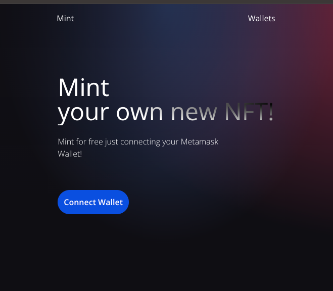

# Eterlast FE Test

## Fake Minting website for Eterlast FE Test



## Built With

- React
- Web3.js
- TailwindCss
- Vite

## Getting Started

- To get a local copy of the repository please run the following commands on your terminal:
   ```
   git clone https://github.com/ramiaquista/eterlast-fe-test
   ```
- Go to the cloned directory with `cd eterlast-fe-test`
- Run `npm install` to install all the necessary packages
- After installing everything, you can run now the website with `npm run dev`


## Author

👤 **Ramiro Aquistapace**

- GitHub: [@ramiaquista](https://github.com/ramiaquista)
- Twitter: [@ramiaq1](https://twitter.com/ramiaq1)
- LinkedIn: [RamiroAquistapace](https://www.linkedin.com/in/ramiro-aquistapace-32b61b204/)
